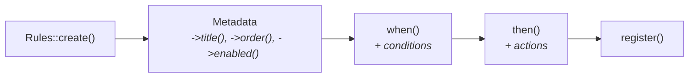

# Building Rules with the Fluent API

MilliRules provides an elegant, fluent API that makes building rules intuitive and readable. This guide covers everything from basic rule creation to advanced pattern matching and complex condition logic.

## The Fluent Interface

The fluent interface allows you to chain methods together to build rules in a natural, readable way:



```php
use MilliRules\Rules;

Rules::create('my_rule')
    ->title('My Rule Title')
    ->order(10)
    ->enabled(true)
    ->when()
        ->condition1()
        ->condition2()
    ->then()
        ->action1()
        ->action2()
    ->register();
```

Each method returns the builder object, allowing you to continue chaining.

## Creating Rules

### Basic Rule Creation

The `create()` method is your starting point:

```php
use MilliRules\Rules;

// Minimal rule with auto-detected type
$rule = Rules::create('rule_id');

// With explicit type
$rule = Rules::create('rule_id', 'wp');  // WordPress rule
$rule = Rules::create('rule_id', 'php'); // PHP rule
```

> [!IMPORTANT]
> Rule IDs must be unique across your entire application. Consider using a prefix to avoid conflicts: `'my_plugin_rule_id'` or `'company_feature_rule'`.

### Replacing and Removing Rules

#### Rule Replacement

Registering a rule with an existing ID **replaces** the previous rule:

```php
// Original rule
Rules::create('api_cache')
    ->when()->request_url('/api/*')
    ->then()->custom('cache_response', ['ttl' => 3600])
    ->register();

// Later: Replace with updated version (same ID)
Rules::create('api_cache')
    ->when()->request_url('/api/*')
    ->then()->custom('cache_response', ['ttl' => 7200])  // Different TTL
    ->register();

// Only the second rule exists - the first was replaced
```

This is useful for:
- Child themes overriding parent theme rules
- Plugins modifying default rules
- Environment-specific rule customization

#### Removing Rules

To completely remove a rule, use `Rules::unregister()`:

```php
// Remove a rule by ID
Rules::unregister('unwanted_rule');

// Example: Child theme disables parent's rule
Rules::unregister('parent_theme_sidebar_rule');

// Example: Conditionally disable rules
if (wp_get_environment_type() === 'production') {
    Rules::unregister('debug_logging_rule');
}
```

> [!TIP]
> `Rules::unregister()` returns `true` if the rule was found and removed, `false` otherwise.

### Rule Metadata

Add descriptive information to your rules:

```php
Rules::create('api_cache_control')
    ->title('Control API Response Caching')   // Human-readable title
    ->order(15)                               // Execution sequence
    ->enabled(true)                           // Enable/disable
    ->register();
```

#### Setting Execution Order

The `order()` method controls when rules execute (lower numbers execute first):

```php
// These execute in sequence: security → cache → logging
Rules::create('security_check')->order(5)->when()->then()->register();
Rules::create('cache_control')->order(10)->when()->then()->register();
Rules::create('request_logging')->order(15)->when()->then()->register();
```

> [!TIP]
> Use order increments of 5 or 10 to leave room for inserting rules between existing ones later.

#### Enabling/Disabling Rules

```php
// Enable rule
Rules::create('my_rule')->enabled(true)->when()->then()->register();

// Disable rule (useful for testing or feature flags)
Rules::create('my_rule')->enabled(false)->when()->then()->register();

// Use constant for dynamic control
Rules::create('debug_rule')
    ->enabled(defined('WP_DEBUG') && WP_DEBUG)
    ->when()->then()->register();
```

## Building Conditions

Conditions determine when a rule should execute. The `when()` method starts the condition builder.

### Basic Conditions

```php
Rules::create('check_request')
    ->when()
        ->request_url('/api/users')       // Check URL
        ->request_method('POST')          // Check HTTP method
    ->then()
        ->custom('process_users')
    ->register();
```

### Condition Chaining

Chain multiple conditions together:

```php
Rules::create('secure_api')
    ->when()
        ->request_url('/api/*')                               // URL pattern
        ->request_method('POST')                              // HTTP method
        ->request_header('Content-Type', 'application/json')  // Header
        ->cookie('session_id')                                // Cookie exists
    ->then()
        ->custom('process_request')
    ->register();
```

By default, **all conditions must be true** (AND logic).

### Match Types: Controlling Condition Logic

MilliRules supports three match types that control how conditions are evaluated:

#### Match All (AND Logic) - Default

All conditions must be true:

```php
Rules::create('strict_validation')
    ->when()  // Implicitly uses match_all()
        ->request_url('/api/secure')
        ->request_method('POST')
        ->cookie('auth_token')
    ->then()
        ->custom('process_secure_request')
    ->register();
```

**Evaluates as**: `condition1 AND condition2 AND condition3`

#### Match Any (OR Logic)

At least one condition must be true:

```php
Rules::create('flexible_access')
    ->when()
        ->match_any()  // Use OR logic
        ->request_url('/public/*')
        ->cookie('visitor_token')
        ->is_user_logged_in()
    ->then()
        ->custom('grant_access')
    ->register();
```

**Evaluates as**: `condition1 OR condition2 OR condition3`

#### Match None (NOT Logic)

All conditions must be false:

```php
Rules::create('production_only')
    ->when()
        ->match_none()  // Use NOT logic
        ->constant('WP_DEBUG', true)
        ->constant('WP_LOCAL_DEV', true)
    ->then()
        ->custom('enable_production_features')
    ->register();
```

**Evaluates as**: `NOT condition1 AND NOT condition2`

### Alternative Match Type Methods

You can also use dedicated methods to start condition building with a specific match type:

```php
// These are equivalent:
->when()->match_all()
->when_all()

->when()->match_any()
->when_any()

->when()->match_none()
->when_none()
```

**Example with alternative syntax**:

```php
Rules::create('development_environments')
    ->when_any()  // Start with OR logic
        ->constant('WP_DEBUG', true)
        ->constant('WP_ENVIRONMENT_TYPE', 'local')
        ->constant('WP_ENVIRONMENT_TYPE', 'development')
    ->then()
        ->custom('enable_debug_tools')
    ->register();
```

> [!WARNING]
> You cannot mix match types within a single `when()` block. Choose one match type and stick with it for that condition group.

## Seamless Builder Transitions

The fluent API allows seamless transitions between builders:

```php
Rules::create('wordpress_admin_check')
    ->when()
        ->request_url('/wp-admin/*')
        ->is_user_logged_in()  // WordPress condition
    // Automatically transitions from ConditionBuilder to Rules
    ->then()
        ->custom('log_admin_access')
    ->register();
```

This works because:
1. The `->when()` method returns a `ConditionBuilder`
2. WordPress conditions (like `is_user_logged_in()`) are not defined on `ConditionBuilder`
3. The builder's `__call()` magic method detects this
4. It adds the condition and returns the parent `Rules` object
5. You can seamlessly call `->then()` to build actions

### Manual Builder Management

For more control, you can manually manage builder instances:

```php
$rule = Rules::create('complex_rule');

$conditions = $rule->when();
$conditions->request_url('/api/*');
$conditions->request_method('POST');

$actions = $rule->then();
$actions->custom('validate_data');
$actions->custom('process_request');

$rule->register();
```

## Building Actions

Actions execute when conditions are satisfied. The `then()` method starts the action builder.

### Basic Actions

```php
Rules::create('process_request')
    ->when()
        ->request_url('/api/process')
    ->then()
        ->custom('log_request')
        ->custom('validate_data')
        ->custom('process_data')
        ->custom('send_response')
    ->register();
```

Actions execute **sequentially** in the order they're defined.

### Action Configuration

Pass configuration to actions using arrays:

```php
Rules::create('send_notification')
    ->when()
        ->request_url('/api/notify')
    ->then()
        ->custom('send_email', [
            'value' => 'admin@example.com',
            'subject' => 'New Notification',
            'message' => 'You have a new notification'
        ])
        ->custom('log_notification', [
            'value' => 'Email sent to admin'
        ])
    ->register();
```

### Inline Actions with Closures

For simple operations, define actions inline:

```php
use MilliRules\Context;

Rules::register_action('inline_log', function($args, Context $context) {
    $message = $args['value'] ?? 'No message';
    error_log('MilliRules: ' . $message);
});

Rules::create('use_inline_action')
    ->when()->request_url('/test')
    ->then()->custom('inline_log', ['value' => 'Test URL accessed'])
    ->register();
```

## Using Operators

Operators control how condition values are compared. While MilliRules auto-detects operators, you can specify them explicitly.

### Explicit Operator Specification

```php
Rules::create('operator_examples')
    ->when()
        // Equality
        ->request_method('GET', '=')       // Exact match (default)
        ->request_method('POST', '!=')     // Not equal

        // Numeric comparison
        ->request_param('age', '18', '>')  // Greater than
        ->request_param('age', '65', '<')  // Less than

        // Pattern matching
        ->request_url('/admin/*', 'LIKE')  // Wildcard pattern
        ->request_url('/^\\/api\\/v[0-9]+\\//i', 'REGEXP')  // Regex

        // Array membership
        ->request_method(['GET', 'HEAD'], 'IN')  // In array
        ->request_method(['POST', 'PUT'], 'NOT IN')  // Not in array

        // Existence checking
        ->cookie('session_id', null, 'EXISTS')      // Cookie exists
        ->cookie('temp_token', null, 'NOT EXISTS')  // Cookie doesn't exist

        // Boolean comparison
        ->constant('WP_DEBUG', true, 'IS')      // Is true
        ->constant('WP_DEBUG', false, 'IS NOT') // Is not true
    ->then()
        ->custom('action')
    ->register();
```

### Auto-Detected Operators

MilliRules automatically infers operators from values:

```php
Rules::create('auto_operators')
    ->when()
        // String → '=' operator
        ->request_method('GET')

        // Array → 'IN' operator
        ->request_method(['GET', 'HEAD'])

        // Boolean → 'IS' operator
        ->constant('WP_DEBUG', true)

        // Null → 'EXISTS' operator
        ->cookie('session_id')

        // String with wildcards → 'LIKE' operator
        ->request_url('/admin/*')

        // String starting with '/' → 'REGEXP' operator
        ->request_url('/^\\/api\\//i')
    ->then()
        ->custom('action')
    ->register();
```

> [!TIP]
> Let MilliRules auto-detect operators for cleaner code. Only specify operators explicitly when you need precise control or when auto-detection doesn't match your intent.

For complete operator documentation, see [Operators and Pattern Matching](./04-operators.md).

## Custom Conditions

When built-in conditions aren't enough, use custom conditions.

### Inline Custom Conditions

```php
use MilliRules\Context;

Rules::register_condition('is_weekend', function(Context $context) {
    $day = date('N'); // 1 (Monday) to 7 (Sunday)
    return $day >= 6; // Saturday or Sunday
});

Rules::create('weekend_special')
    ->when()
        ->custom('is_weekend')
        ->request_url('/special-offer')
    ->then()
        ->custom('show_weekend_discount')
    ->register();
```

### Parameterized Custom Conditions

```php
use MilliRules\Context;

Rules::register_condition('time_range', function($args, Context $context) {
    $current_hour = (int) date('H');
    $start = $args['start'] ?? 0;
    $end = $args['end'] ?? 23;

    return $current_hour >= $start && $current_hour <= $end;
});

Rules::create('business_hours')
    ->when()
        ->custom('time_range', ['start' => 9, 'end' => 17])
    ->then()
        ->custom('show_business_hours_message')
    ->register();
```

See [Creating Custom Conditions](../03-customization/01-custom-conditions.md) for advanced techniques.

## WordPress Hook Integration

WordPress rules can execute on specific hooks:

```php
Rules::create('admin_notice', 'wp')
    ->on('admin_notices', 10)  // Hook name and priority
    ->when()
        ->is_user_logged_in()
        ->constant('WP_DEBUG', true)
    ->then()
        ->custom('show_debug_notice')
    ->register();
```

### Common WordPress Hooks

```php
// Initialization
->on('init', 10)
->on('plugins_loaded', 10)

// Frontend
->on('wp', 10)
->on('template_redirect', 10)
->on('wp_enqueue_scripts', 10)

// Admin
->on('admin_init', 10)
->on('admin_menu', 10)
->on('admin_notices', 10)

// Content
->on('the_content', 10)
->on('the_title', 10)

// Saving
->on('save_post', 10)
->on('wp_insert_post', 10)
```

> [!NOTE]
> The `->on()` method automatically sets the rule type to `'wp'`. You don't need to specify the type explicitly when using hooks.

## Advanced Patterns

### 1. Conditional Rule Registration

Register rules only when needed:

```php
if (is_admin()) {
    Rules::create('admin_only_rule')
        ->when()->is_user_logged_in()
        ->then()->custom('admin_action')
        ->register();
}

if (defined('WP_CLI') && WP_CLI) {
    Rules::create('cli_only_rule')
        ->when()->custom('is_cli_context')
        ->then()->custom('cli_action')
        ->register();
}
```

### 2. Dynamic Rule Generation

Generate rules programmatically:

```php
$protected_urls = ['/admin', '/dashboard', '/settings'];

foreach ($protected_urls as $url) {
    Rules::create('protect_' . sanitize_title($url))
        ->when()
            ->request_url($url . '/*')
            ->is_user_logged_in(false)  // Not logged in
        ->then()
            ->custom('redirect_to_login', ['url' => $url])
        ->register();
}
```

### 3. Rule Groups with Shared Configuration

Create related rules with shared settings:

```php
$api_rules_config = [
    'order' => 10,
    'type' => 'php',
];

$api_endpoints = ['users', 'posts', 'comments'];

foreach ($api_endpoints as $endpoint) {
    Rules::create("api_{$endpoint}_cache")
        ->order($api_rules_config['order'])
        ->when()
            ->request_url("/api/{$endpoint}/*")
            ->request_method('GET')
        ->then()
            ->custom('set_cache_headers', ['duration' => 3600])
        ->register();
}
```

### 4. Nested Condition Logic Simulation

While MilliRules doesn't support nested conditions directly, you can simulate them with multiple rules:

```php
// Simulate: (A AND B) OR (C AND D)

// Rule 1: A AND B
Rules::create('condition_group_1')->order(10)
    ->when()
        ->request_url('/special/*')      // A
        ->cookie('premium_user')         // B
    ->then()
        ->custom('grant_access')
    ->register();

// Rule 2: C AND D
Rules::create('condition_group_2')->order(10)
    ->when()
        ->is_user_logged_in()            // C
        ->constant('EARLY_ACCESS', true) // D
    ->then()
        ->custom('grant_access')
    ->register();
```

## Method Chaining Reference

### Rule Builder Methods

| Method        | Parameters                    | Returns            | Description                              |
|---------------|-------------------------------|--------------------|------------------------------------------|
| `create()`    | `string $id, ?string $type`   | `Rules`            | Create new rule                          |
| `title()`     | `string $title`               | `Rules`            | Set rule title                           |
| `order()`     | `int $order`                  | `Rules`            | Set execution order                      |
| `enabled()`   | `bool $enabled`               | `Rules`            | Enable/disable rule                      |
| `when()`      | -                             | `ConditionBuilder` | Start condition builder                  |
| `when_all()`  | -                             | `ConditionBuilder` | Start with AND logic                     |
| `when_any()`  | -                             | `ConditionBuilder` | Start with OR logic                      |
| `when_none()` | -                             | `ConditionBuilder` | Start with NOT logic                     |
| `then()`      | `?array $actions`             | `ActionBuilder`    | Start action builder                     |
| `on()`        | `string $hook, int $priority` | `Rules`            | Set WordPress hook                       |
| `register()`  | -                             | `bool`             | Register rule (replaces if ID exists)    |
| `unregister()`| `string $rule_id`             | `bool`             | Remove rule by ID (static method)        |

### Condition Builder Methods

| Method            | Parameters                 | Returns            | Description               |
|-------------------|----------------------------|--------------------|---------------------------|
| `match_all()`     | -                          | `ConditionBuilder` | Use AND logic             |
| `match_any()`     | -                          | `ConditionBuilder` | Use OR logic              |
| `match_none()`    | -                          | `ConditionBuilder` | Use NOT logic             |
| `custom()`        | `string $type, mixed $arg` | `ConditionBuilder` | Add custom condition      |
| `add_namespace()` | `string $namespace`        | `ConditionBuilder` | Add condition namespace   |
| `{dynamic}()`     | `mixed ...$args`           | `mixed`            | Dynamic condition methods |

### Action Builder Methods

| Method            | Parameters                 | Returns         | Description            |
|-------------------|----------------------------|-----------------|------------------------|
| `custom()`        | `string $type, mixed $arg` | `ActionBuilder` | Add custom action      |
| `add_namespace()` | `string $namespace`        | `ActionBuilder` | Add action namespace   |
| `{dynamic}()`     | `mixed ...$args`           | `mixed`         | Dynamic action methods |

## Best Practices

### 1. Use Descriptive Rule IDs

```php
// ✅ Good - clear and descriptive
Rules::create('block_non_authenticated_api_access')
Rules::create('cache_public_api_responses')
Rules::create('log_admin_user_actions')

// ❌ Bad - unclear and unmaintainable
Rules::create('rule1')
Rules::create('check')
Rules::create('x')
```

### 2. Add Titles to All Rules

```php
// ✅ Good - includes helpful title
Rules::create('api_authentication')
    ->title('Enforce API Authentication')
    ->when()->request_url('/api/*')
    ->then()->custom('check_auth')
    ->register();

// ❌ Bad - no title makes debugging harder
Rules::create('api_authentication')
    ->when()->request_url('/api/*')
    ->then()->custom('check_auth')
    ->register();
```

### 3. Keep Condition Groups Logical

```php
// ✅ Good - logical grouping
Rules::create('secure_api_access')
    ->when()
        ->request_url('/api/secure/*')    // Context: API endpoint
        ->request_method('POST')          // Context: HTTP method
        ->cookie('auth_token')            // Context: Authentication
    ->then()->custom('process_secure_request')
    ->register();

// ❌ Bad - unrelated conditions
Rules::create('random_checks')
    ->when()
        ->request_url('/api/*')
        ->is_home()                       // Unrelated to API
        ->constant('WP_DEBUG', true)      // Unrelated to request
    ->then()->custom('do_something')
    ->register();
```

### 4. Use Comments for Complex Logic

```php
Rules::create('complex_caching_logic')
    ->order(15)
    ->when()
        // Check if this is a cacheable request
        ->request_method(['GET', 'HEAD'], 'IN')

        // Ensure we're not in admin or login areas
        ->request_url('/wp-admin/*', 'NOT LIKE')
        ->request_url('/wp-login.php', '!=')

        // Verify user preferences allow caching
        ->cookie('disable_cache', null, 'NOT EXISTS')
    ->then()
        ->custom('apply_caching_headers')
    ->register();
```

### 5. Test Rules Incrementally

```php
// Start simple
Rules::create('test_rule')
    ->when()->request_url('/test')
    ->then()->custom('log', ['value' => 'Test URL hit'])
    ->register();

// Add complexity gradually
Rules::create('test_rule')
    ->when()
        ->request_url('/test')
        ->request_method('POST')  // Add second condition
    ->then()
        ->custom('log', ['value' => 'Test POST hit'])
    ->register();
```

## Common Pitfalls

### 1. Forgetting to Register

```php
// ❌ Wrong - rule never registered
Rules::create('my_rule')
    ->when()->request_url('/test')
    ->then()->custom('action');
// Missing ->register()

// ✅ Correct
Rules::create('my_rule')
    ->when()->request_url('/test')
    ->then()->custom('action')
    ->register();  // Always register!
```

### 2. Mixing Match Types

```php
// ❌ Wrong - cannot switch match types mid-chain
Rules::create('mixed_logic')
    ->when()
        ->match_all()
        ->condition1()
        ->match_any()  // Cannot switch!
        ->condition2()

// ✅ Correct - use one match type
Rules::create('consistent_logic')
    ->when_any()
        ->condition1()
        ->condition2()
```

### 3. Incorrect Hook Timing

```php
// ❌ Wrong - registering rules too late
add_action('wp_footer', function() {
    MilliRules::init();
    Rules::create('my_rule')->on('init')->when()->then()->register();
    // 'init' hook already fired!
});

// ✅ Correct - register early
add_action('plugins_loaded', function() {
    MilliRules::init();
    Rules::create('my_rule')->on('template_redirect')->when()->then()->register();
}, 1); // Early priority
```

## Troubleshooting

### Rules Not Executing

**Check initialization**:
```php
// Verify MilliRules is initialized
$packages = MilliRules::get_loaded_packages();
error_log('Loaded packages: ' . print_r($packages, true));
```

**Verify rule registration**:
```php
Rules::create('debug_rule')
    ->title('Debug Rule')
    ->when()->request_url('*')
    ->then()->custom('log', ['value' => 'Rule executed'])
    ->register();

error_log('Rule registered');
```

**Check execution statistics**:
```php
$result = MilliRules::execute_rules();
error_log('Execution stats: ' . print_r($result, true));
```

### Conditions Not Matching

Add debugging to your conditions:

```php
use MilliRules\Context;

Rules::register_condition('debug_condition', function(Context $context) {
    $array = $context->to_array();
    error_log('Context: ' . print_r($array, true));
    return true;
});

Rules::create('debug_rule')
    ->when()
        ->custom('debug_condition')
        ->your_actual_condition()
    ->then()->custom('action')
    ->register();
```

## Next Steps

- **[Built-in Conditions Reference](../05-reference/01-conditions.md)** - Explore all available conditions
- **[Operators and Pattern Matching](./04-operators.md)** - Master comparison operators
- **[Custom Conditions](../03-customization/01-custom-conditions.md)** - Create your own conditions
- **[WordPress Integration](../04-advanced/03-wordpress-integration.md)** - WordPress-specific features

---

**Need more examples?** Check out [Real-World Examples](../04-advanced/01-examples.md) for complete, working code samples.
